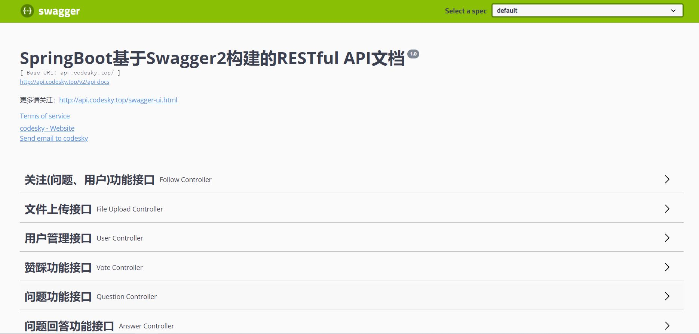

# codesky-api
仿知乎问答社区后端API

a RESTful api for website or App

## API Document
采用Swagger2实现了基于SpringBoot的RESTful API的文档。

在线API文档地址：[http://api.codesky.top/swagger-ui.html](http://api.codesky.top/swagger-ui.html)



## 用户登录功能分析
登录实现采用了`Spring Security + Session based on cookie`,为了安全，`Cookies['JSESSIONID']`设置为`httponly`。


登录状态有四种，如下：

1. 用户未登录或登录超时（session or cookie过期）
```
// 服务端返回http状态码
UNAUTHORIZED(401, "Unauthorized")

// 服务端返回response body (JSON data)
{
  "code": 401,
  "msg": "未登录或登录超时"
}
```

2. 用户权限不足
```
// 服务端返回http状态码
FORBIDDEN(403, "Forbidden")

// 服务端返回response body (JSON data)
{
  "code": 403,
  "msg": "权限不足"
}
```

3. 登录失败，用户名或密码错误
```
// 服务端返回http状态码
UNAUTHORIZED(401, "Unauthorized")

// 服务端返回response body (JSON data)
{
  "code": 401,   //考虑自定义错误码
  "msg": "用户名或密码错误"
}
```

4. 登录成功
```
// 服务端返回http状态码
OK(200, "OK")

// 考虑两种方案：登录成功直接返回用户信息 or 客户端主动调用getUserInfo
{
  "code": 200,
  "msg": "登录成功",
  "data": {
    "id": 1,
    "name": "helloworld",
    "avatarUrl": "http://api.codesky.top/images/c399b950f08c42fa93c98e4d0ccddccc.jpg",
    "gender": 1
  }
}
```

登录界面设计：


## 用户注册

注册信息包括：
- **用户名（唯一，需要判断是否重复）**
- **密码+确认密码**              
- 头像： 非必填项，可以后期上传
- 介绍： 非必需项，一句话介绍


注册界面设计：


## 问题版块

抽取知乎问题例子填充数据，应用冷启动

1. [为什么996工作制只提互联网公司，其他行业没有吗？](https://www.zhihu.com/question/318332330/answer/642150519)

2. [既然Java反射可以访问和修改私有成员变量，那封装成private还有意义么？](https://www.zhihu.com/question/28161668/answer/518225224)

3. [2019年校招，你经历了什么？](https://www.zhihu.com/question/276338433)

4. [怎么看待央视网力挺B站？](https://www.zhihu.com/question/320618882/answer/656434484)

5. [为什么有些科研人员觉得「996 还要 +0.5」？](https://www.zhihu.com/question/319997919/answer/650577928)

6. [有哪些原版英文书籍值得推荐？](https://www.zhihu.com/question/19929256/answer/645879195)


### todo list:

- [X] 重新设计用户表，拆分认证信息和描述信息
- [X] 重新设计问题 评论表
- [x] 增加问题tag（话题版块）
- [x] 问题发布，敏感词过滤（爬取知乎数据，填充数据库，冷启动）
- [x] 关注功能（关注问题 or 用户 or 话题），增加关注和粉丝列表 mysql or redis
- [ ] 私信功能，私信（from,to,content）数据结构
- [ ] timeline功能，设计Feed表（xx关注了问题，回答了问题，XXX关注了你）
- [x] 增加异步处理功能
- [ ] 增加评论页面
