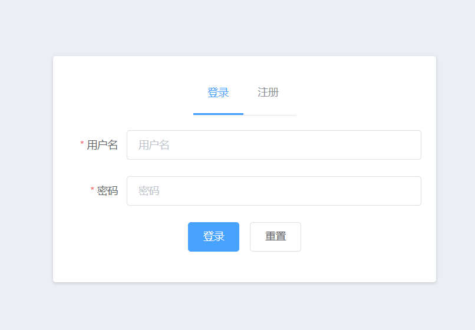
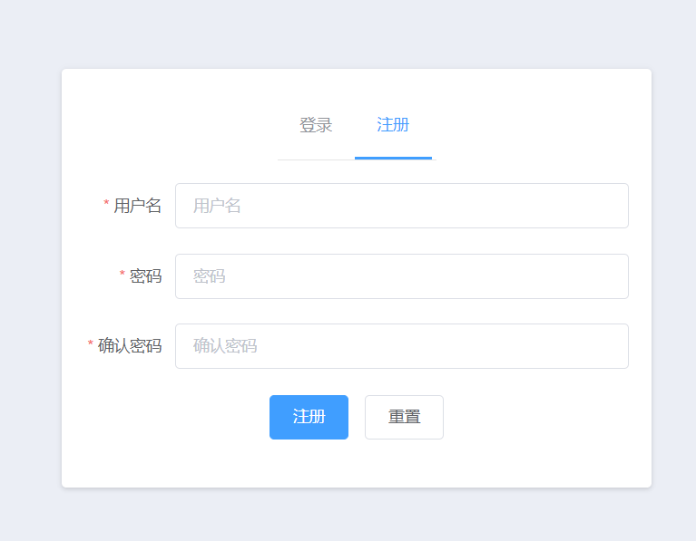

# codesky-api
仿知乎问答社区后端API

a RESTful api for website or App

## API Document
采用Swagger实现基于SpringBoot的RESTful api的文档。

[http(s)://domain_name:port//swagger-ui.html](http://localhost:8081/swagger-ui.html)


## 用户登录
登录实现采用了`Spring Security + Session based on cookie`,为了安全，`Cookies['JSESSIONID']`设置为`httponly`。


登录状态有四种，如下：

1. 用户未登录或登录超时（session or cookie过期）
```
// 服务端返回http状态码
UNAUTHORIZED(401, "Unauthorized")

// 服务端返回response body (JSON data)
{
  "code": 401,
  "msg": "未登录或登录超时"
}
```

2. 用户权限不足
```
// 服务端返回http状态码
FORBIDDEN(403, "Forbidden")

// 服务端返回response body (JSON data)
{
  "code": 403,
  "msg": "权限不足"
}
```

3. 登录失败，用户名或密码错误
```
// 服务端返回http状态码
UNAUTHORIZED(401, "Unauthorized")

// 服务端返回response body (JSON data)
{
  "code": 601,   //考虑自定义错误码
  "msg": "用户名或密码错误"
}
```

4. 登录成功
```
// 服务端返回http状态码
OK(200, "OK")

// 考虑两种方案：登录成功直接返回用户信息 or 客户端主动调用getUserInfo
{
  "code": 200,
  "msg": "登录成功",
  "data": {
    "id": 1,
    "name": "helloworld",
    "avatarUrl": "https://images.nowcoder.com/images/20170615/1347798_1497491166458_8E7B0656F73A23F6ECE12F2DAD72C5A7@0e_100w_100h_0c_1i_1o_90Q_1x",
    "gender": 1
  }
}
```

登录界面设计：


## 用户注册

注册信息包括：
- **用户名（唯一，需要判断是否重复）**
- **密码+确认密码**              
- 头像： 非必填项，可以后期上传
- 介绍： 非必需项，一句话介绍


注册界面设计：


## 问题版块

抽取知乎问题例子填充数据，应用冷启动

1. [为什么996工作制只提互联网公司，其他行业没有吗？](https://www.zhihu.com/question/318332330/answer/642150519)

2. [既然Java反射可以访问和修改私有成员变量，那封装成private还有意义么？](https://www.zhihu.com/question/28161668/answer/518225224)

3. [2019年校招，你经历了什么？](https://www.zhihu.com/question/276338433)

4. [怎么看待央视网力挺B站？](https://www.zhihu.com/question/320618882/answer/656434484)

5. [为什么有些科研人员觉得「996 还要 +0.5」？](https://www.zhihu.com/question/319997919/answer/650577928)

6. [有哪些原版英文书籍值得推荐？](https://www.zhihu.com/question/19929256/answer/645879195)


问题数据库结构设计:
{

}

```
{
  "code": 200,
  "msg": "获取问题成功",
  "data": [
    {
      "id": 2,
      "title": "电视剧《权力的游戏》中有哪些细思极恐的细节？",
      "answerCount": 0,
      "gmtCreate": "2019-04-25T08:03:39.000+0000",
      "gmtModified": "2019-04-25T08:03:39.000+0000",
      "content": "<p>谢谢邀请，其实前天就看到了这个问题。看了一部分答案。与技术有关的回答都很正确，其实就不是很想回答这个问题。不过发现这个问题这两天总是突然出现在我脑海就还是回答一下吧。</p><p>其实，这个问题和很多人说的一样是两个问题，一个是测试天天想转开发，一个是扰乱军心。</p><p>先说我的观点，一.想转测试的员工一般都比较优秀。二、测试团队一般一半以上人是不会有想转开发念头的。所以如果只是想转开发就能扰乱军心这个本身是不会成立的，因为大多数人无从可扰。反而应该考虑是否是你们的团队开发的待遇比测试好很多或团队氛围中开发工作对于测试有很强的鄙视，可能是出现这种事情的根源。</p><p>举一个身边真实朋友的例子。小Y毕业第一年被公司强制分配测试工作，这兄弟当时明确提出一不做测试二想去鹅厂，1年内没转成开发离职。后入职某银行做开发，5年时入鹅厂，目前离职新工作依然是开发，年薪80。</p><p>所以如果问这个问题的同学，如果是测试组长的话，建议和这种想法同学好好谈谈，如果真是对技术特别感兴趣的建议鼓励她开发测试工具试试，是个双赢之举。如果是其它原因就好好引导吧。没有无缘无故的恨，也没有无缘无故的爱对吧？</p>",
      "author": {
        "id": 1,
        "username": "helloworld",
        "avatarUrl": "https://images.nowcoder.com/images/20170615/1347798_1497491166458_8E7B0656F73A23F6ECE12F2DAD72C5A7@0e_100w_100h_0c_1i_1o_90Q_1x"
      }
    },
    {
      "id": 3,
      "title": "干货|阿里资深算法工程师《AI算法工程师手册》下载！",
      "answerCount": 0,
      "gmtCreate": "2019-04-25T08:07:03.000+0000",
      "gmtModified": "2019-04-25T08:07:03.000+0000",
      "content": "<blockquote><b>Python算法学习与机器学习算法报道  </b><br/>编辑：Cookies</blockquote><p><b>【导读】</b>小编最近发现了一本非常细致的AI算法工程师手册”，这是作者华校专搜集的个人笔记并整理成册，目前还在不断更新。后。</p><p>",
      "author": {
        "id": 1,
        "username": "helloworld",
        "avatarUrl": "https://images.nowcoder.com/images/20170615/1347798_1497491166458_8E7B0656F73A23F6ECE12F2DAD72C5A7@0e_100w_100h_0c_1i_1o_90Q_1x"
      }
    },
    {
      "id": 4,
      "title": "为什么很多人要禁止 Windows 10 自动更新？",
      "answerCount": 0,
      "gmtCreate": "2019-04-25T08:08:25.000+0000",
      "gmtModified": "2019-04-25T08:08:25.000+0000",
      "content": "为什么很多人要禁止 Windows 10 自动更新？",
      "author": {
        "id": 1,
        "username": "helloworld",
        "avatarUrl": "https://images.nowcoder.com/images/20170615/1347798_1497491166458_8E7B0656F73A23F6ECE12F2DAD72C5A7@0e_100w_100h_0c_1i_1o_90Q_1x"
      }
    }
  ]
}
```


### todo list:

- 重新设计用户表，拆分认证信息和描述信息
- 重新设计问题 评论表
- 增加问题tag（话题版块）
- 问题发布，敏感词过滤（爬取知乎数据，填充数据库，冷启动）
- 关注功能（关注问题 or 用户 or 话题），增加关注和粉丝列表 mysql or redis
- 私信功能，私信（from,to,content）数据结构
- timeline功能，设计Feed表（xx关注了问题，回答了问题，XXX关注了你）
- 增加异步处理功能

- 增加页面
